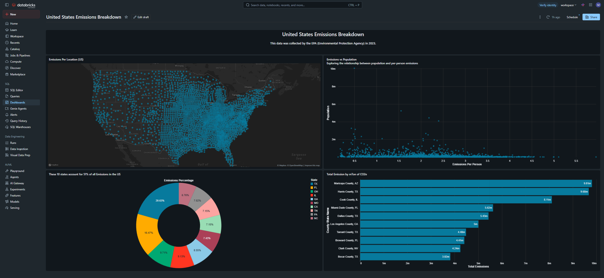
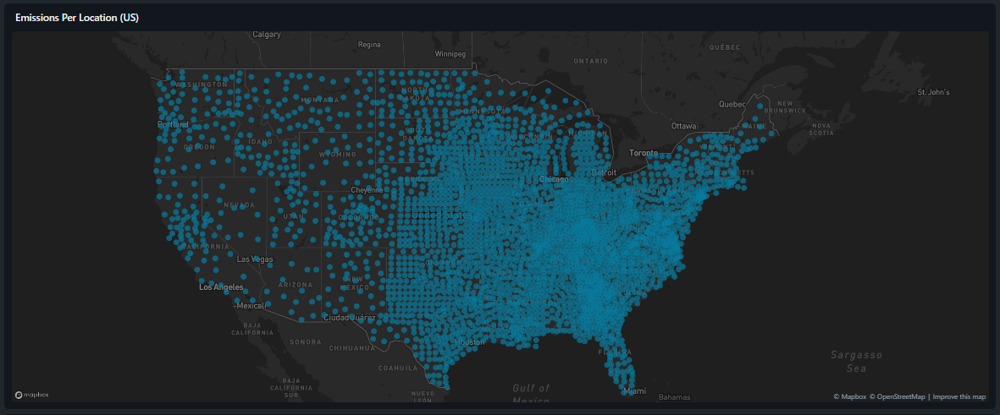
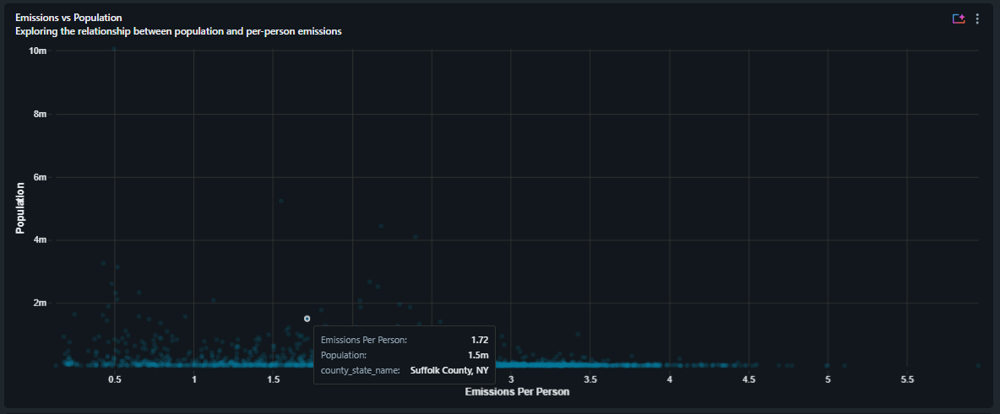
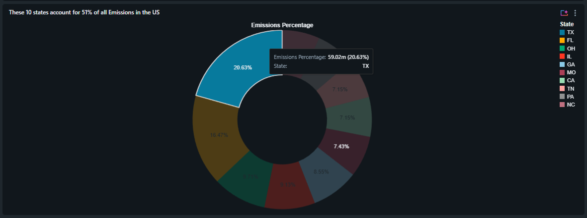
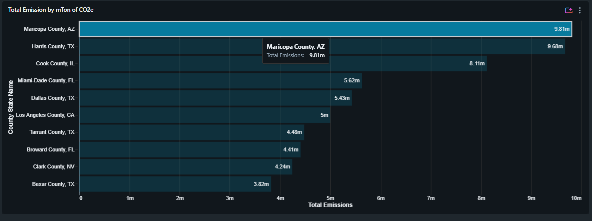

# United States Emissions Breakdown Dashboard

An interactive analytics dashboard built in Databricks exploring US greenhouse
gas emissions using EPA data from 2023. The dashboard surfaces where emissions
are concentrated geographically, how they relate to population, and which
counties and states carry the largest share of total output.

## What it shows

**Emissions per location (US)**
A geospatial view plotting emission sources across the country on a Mapbox
layer. The density makes regional concentration immediately visible, with
clear clustering through the industrial Midwest, the Gulf coast, and the
eastern seaboard.

**Emissions vs population**
A scatter plot exploring the relationship between a county's population and its
emissions per person. More populous counties tend to sit lower on the
per-person axis, consistent with the efficiencies of denser urban areas.
Suffolk County, NY is highlighted as an example at roughly 1.5m people and 1.72
emissions per person.

**Emissions percentage by state**
A donut chart showing that the top 10 states account for 51% of all US
emissions. Texas leads at 20.63% (59.02m), followed by Florida at 16.47%,
with the remaining share spread across Ohio, Illinois, Georgia and others.

**Total emissions by county**
A ranked bar chart of the highest-emitting counties measured in mTon of CO2e.
Maricopa County, AZ tops the list at 9.81m, narrowly ahead of Harris County, TX
(9.68m) and Cook County, IL (8.11m).

## Data

- Source: US Environmental Protection Agency (EPA), 2023
- Grain: county level, aggregated to state where relevant
- Metrics: total emissions (mTon CO2e), emissions per person, population

## Tech stack

- Databricks (SQL, Dashboards)
- Mapbox / OpenStreetMap for the geospatial layer
- SQL for aggregation and transformation

## Notes

This is a portfolio project demonstrating data visualisation and dashboard
design in Databricks. The live dashboard sits inside a Databricks workspace and
requires access, so the screenshots above are the canonical view.
