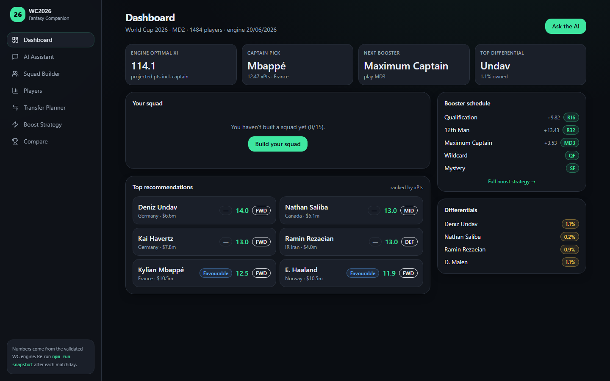
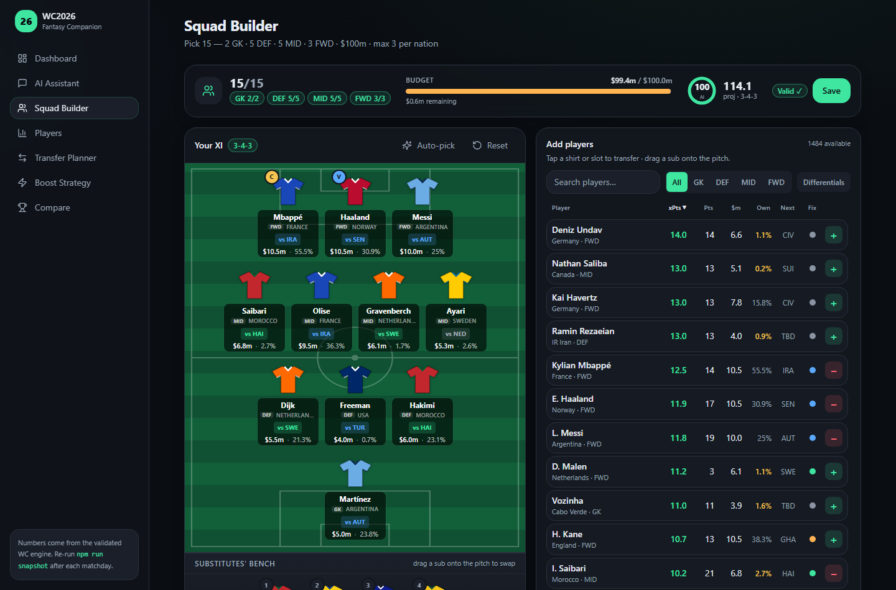
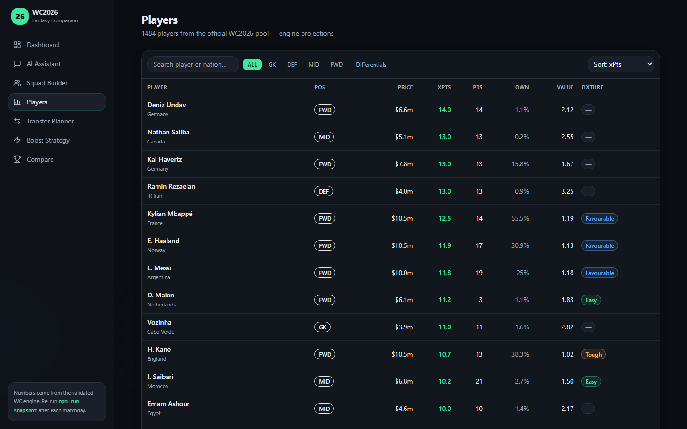
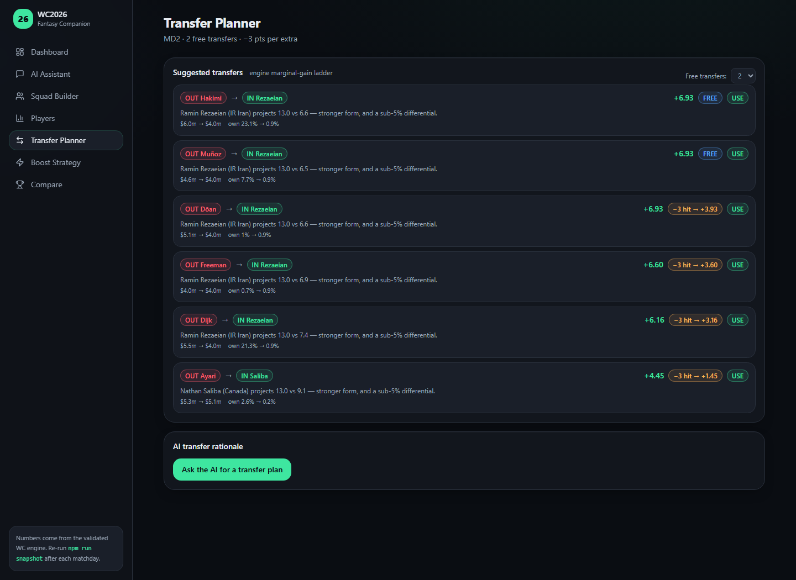
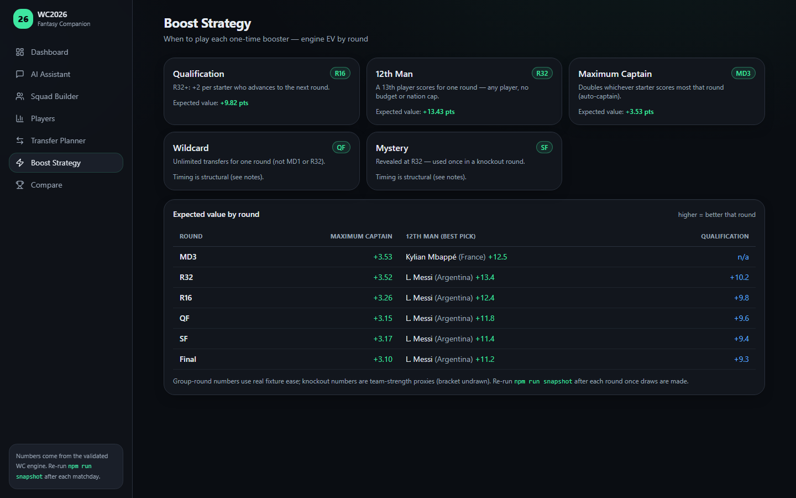

# WC2026 Fantasy — from live data to a playable companion

An end-to-end, locally-hosted fantasy-football companion for the **FIFA World Cup 2026**.
It pulls live football and official FIFA-fantasy data, computes its own player projections,
optimal squad, transfer ladder and booster (chip) plan, and serves it all through a
Next.js web app with an optional Claude chat layer grounded in the model's own numbers.

**Stack:** Python (ETL + analytics) · Next.js 14 / TypeScript / Tailwind (app) · SQLite + Prisma · Anthropic API (optional chat)

[](https://github.com/MWren-tech/Projects/actions/workflows/ci.yml)

> **▶ Live demo: [wc-azure.vercel.app](https://wc-azure.vercel.app/)** — a hosted, read-only build **showing Matchday 2 predictions (data captured 20 Jun 2026)**. One-click setup in [DEPLOY.md](DEPLOY.md).

Built as a two-part monorepo. The two halves are deliberately decoupled and touch through
exactly **one file** — `wc-companion/data/snapshot.json`:

```
   EXTRACT              TRANSFORM                       LOAD            DISPLAY
 ┌───────────┐   ┌───────────────────────┐   ┌──────────────────┐   ┌──────────────┐
 │ API-Football│  │  wc_scout (Python)     │  │  snapshot.json    │  │ wc-companion │
 │ FIFA feeds  │─►│  projections · scoring │─►│  (the contract)   │─►│  Next.js UI  │
 │ (HTTP)      │  │  optimiser · boosters  │  │  1,484 players    │  │ + Claude chat│
 └───────────┘   └───────────────────────┘   └──────────────────┘   └──────────────┘
                        run daily / on demand         read-only         locally hosted
```

The model is the **only** source of numbers; the app never invents players, prices or
stats — it arranges and displays engine output, and the in-app assistant is grounded to
the snapshot's player list.

---

## The data is a point-in-time snapshot

Fantasy value is a moving target. A player's projection, their **ownership**, and therefore
the **optimal squad, captain pick and transfer suggestions all shift every matchday** — as
minutes accumulate, prices and ownership move, injuries land and fixtures resolve. A lineup
that is "optimal" one day is not the next: it is optimal *for the ownership landscape and the
capture date it was computed from*. Differential picks especially depend on when ownership was
read.

- **This web app (and the bundled `snapshot.json`) shows _Matchday 2_ of the group stage, with
  data captured on _20 June 2026_.** The app header states this on every page
  (`World Cup 2026 · MD2 · engine 20/06/2026`).
- [`wc_scout/sample-output/`](wc_scout/sample-output/) contains ranking outputs captured at
  **different points** during the tournament — compare them to see how the picks move as the
  competition progresses.
- To capture the current state yourself, re-run the engine
  (`python wc_scout/export_snapshot.py --incremental`) and reseed — see [Quickstart](#quickstart).
  The app hot-reloads the new snapshot and the matchday label updates automatically.

---

## Screenshots

The companion running locally against the bundled snapshot.

**Dashboard** — engine optimal XI, captain pick, next booster and top differential at a glance:



| Squad Builder | Players |
|---|---|
|  |  |
| **Transfer Planner** | **Boost Strategy** |
|  |  |

- **Squad Builder** — drag-and-drop pitch, live budget / formation / max-per-nation validation, one-click auto-pick of the engine's optimal XI.
- **Players** — the full 1,484-player pool, searchable and sortable by projected points, price, ownership, value and fixture difficulty.
- **Transfer Planner** — the engine's marginal-gain ladder (points gained per transfer, free vs. −3 hit).
- **Boost Strategy** — expected value of each one-time chip in every remaining round, with the recommended schedule.

---

## Repository layout

```
wc2026-fantasy/
├── wc_scout/              THE MODEL — Python analytics engine (ETL + ranking)
│   ├── export_snapshot.py     entry point: runs the pipeline, writes snapshot.json
│   ├── wc_shortlist.py        builds + incrementally refreshes the player pool
│   ├── optimise.py            ILP optimal-squad solver (PuLP)
│   ├── booster_planner.py     per-round expected value for each chip
│   ├── scoring.py             FIFA scoring constants — single source of truth
│   ├── ... (23 modules)       form windows, national strength, FIFA feeds, set pieces
│   ├── current_squad.json     your held squad (an input to the booster/transfer logic)
│   ├── requirements.txt
│   └── sample-output/         human-readable ranking artifacts the engine produces
│
├── wc-companion/          THE APP — Next.js web companion
│   ├── app/                   App Router pages: players, squad, transfers, boosts, chat
│   ├── components/            squad builder, pitch, tables, compare tool, AI panels
│   ├── services/ai/           the grounded Claude assistant layer
│   ├── lib/ · prisma/         snapshot loader, SQLite persistence
│   └── data/snapshot.json     ◄─ written by the model, read by the app (bundled sample)
│
├── docs/                  architecture, scoring rules, projection model, runbook…
├── reference-data/        source scoring-stat spreadsheets + squad lists (research)
└── .claude/              specialised Claude Code agents used to build this
```

---

## Quickstart

There are two independent things you can run. **You do not need the Python engine to see
the app** — a working `snapshot.json` is bundled, so the app renders the full dataset out
of the box.

### A. Run the app (no API key needed)

```powershell
cd wc-companion
npm install
Copy-Item .env.example .env           # Prisma + the app both read .env; edit to add keys
npm run db:push                       # create the local SQLite db
npm run db:seed                       # load players from the bundled snapshot
npm run dev                           # http://localhost:3000
```

> **Use `.env`, not `.env.local`.** The Prisma CLI (`db:push`) and the seed script only read
> `.env`, so `DATABASE_URL` must live there. Next.js reads `.env` too, so this one file covers
> everything.

Everything except the free-text AI chat works with no keys at all. The chat layer needs a
pay-as-you-go `ANTHROPIC_API_KEY` (not a Claude subscription) — see `wc-companion/.env.example`.

### B. Regenerate the model from live data (needs an API-Football key)

```powershell
cd wc_scout
python -m venv .venv; .\.venv\Scripts\activate
pip install -r requirements.txt
Copy-Item .env.example .env           # paste your API_FOOTBALL_KEY (free tier works)

python export_snapshot.py --refresh       # full rebuild (slow, ~hundreds of API calls)
# thereafter, the fast daily-style refresh:
python export_snapshot.py --incremental   # re-pull WC form + fixtures, re-blend (~1-2 min)
```

This rewrites `../wc-companion/data/snapshot.json`; the app hot-reloads on the file change.
A free API-Football key (~100 requests/day) is enough for `--incremental`; the engine caches
every response to disk to stay under the limit. Get one at <https://www.api-football.com>.

---

## How the ranking works (the Transform step)

Each player's **projected points (xp)** blends several scored windows through the official
FIFA-fantasy ruleset in [`scoring.py`](wc_scout/scoring.py):

- **Club form** — recent per-90 output from domestic leagues (`recent_form.py`)
- **International form** — national-team form over recent windows (`country_form.py`)
- **Live WC form** — actual tournament stats once matches are played (`wc_form.py`)
- **Fixture ease & team strength** — FIFA ranking blended with form, used as an
  advance-probability proxy for the knockouts (`national_strength.py`, `fifa_rankings.py`)
- **Start probability** — projected minutes / probable XI (`probable_xi.py`)
- **Set-piece duty** and a **scouting-bonus** term that prices in low-owned upside

From that pool the engine builds the **optimal squad** (an integer-linear-program under the
budget, formation and max-per-nation rules) and a **booster plan** that assigns each chip to
its highest-EV round. See [`docs/model/projection-model.md`](docs/model/projection-model.md)
and [`docs/data/snapshot-contract.md`](docs/data/snapshot-contract.md) for the details and the
exact JSON contract.

Want to see the output without running anything? Browse
[`wc_scout/sample-output/`](wc_scout/sample-output/) for the ranked lists and reports the
engine emits.

---

## Data sources

- **[API-Football](https://www.api-football.com)** — fixtures, lineups, per-match player stats,
  predictions (club + international competitions).
- **FIFA official fantasy feed** — authoritative prices, ownership, official points and the
  full 48-squad register.

All external calls are cached to disk (`.api_cache/`, `.fifa_cache/`) and never committed.

---

## Engineering decisions

A few deliberate choices, and the reasoning behind them:

- **One JSON contract between the two halves.** The model and app never call each other at
  runtime — they meet only at `snapshot.json`. This keeps the Python engine free to be slow,
  batch and API-heavy while the app stays a fast, stateless reader, and it makes the app
  trivially testable against a fixture. The trade-off (numbers are only as fresh as the last
  export) is acceptable for a tournament that moves one matchday at a time.
- **The model is the single source of truth; the app never invents data.** Even the in-app
  Claude assistant is grounded strictly to the snapshot's player list, so it can't hallucinate
  players or prices. Rankings, prices and the scoring ruleset live in exactly one place
  (`scoring.py`).
- **An ILP for the optimal squad, not a greedy heuristic.** Squad selection is a knapsack with
  budget, formation and max-per-nation constraints — greedy picks miss the optimum, so it's
  solved exactly with PuLP.
- **Local-first, zero cloud dependencies.** SQLite + Prisma and on-disk API caching mean the
  whole thing runs on one machine for free; the schema is portable to Postgres when hosted
  persistence is wanted (see [DEPLOY.md](DEPLOY.md)).
- **Incremental vs. full refresh.** The daily job re-pulls only what changes mid-tournament
  (WC form + fixtures) rather than rebuilding every window, keeping it inside a free API tier's
  ~100 requests/day.

## Tests

The scoring model and the app's advisory math are the parts most worth pinning, so they have
unit tests; CI runs them on every push (typecheck + tests + production build).

```powershell
cd wc_scout && pip install -r requirements-dev.txt && pytest      # engine ruleset
cd wc-companion && npm test                                        # squad/rating logic (vitest)
```

The TypeScript suite includes a regression for a real bug this project hit: depth players carry
a `null` fixture rating, and `null < 0.9` coerces to `true` in JS, which slipped them into a
formatter that crashed the page. The test locks that path.

---

## Documentation

| Topic | Doc |
|---|---|
| Big-picture architecture | [docs/overview/architecture.md](docs/overview/architecture.md) |
| Scoring rules | [docs/model/scoring-rules.md](docs/model/scoring-rules.md) |
| Projection model | [docs/model/projection-model.md](docs/model/projection-model.md) |
| Data sources & endpoints | [docs/model/data-sources.md](docs/model/data-sources.md) |
| Pipeline & refresh modes | [docs/model/pipeline.md](docs/model/pipeline.md) |
| The snapshot.json contract | [docs/data/snapshot-contract.md](docs/data/snapshot-contract.md) |
| App architecture | [docs/webapp/architecture.md](docs/webapp/architecture.md) |
| Run / troubleshoot | [docs/ops/runbook.md](docs/ops/runbook.md) |

---

## Notes

- **Local & free by design** — SQLite + Prisma, no cloud account required.
- The bundled `snapshot.json` is a point-in-time sample; regenerate it (step B) for live numbers.
- Secrets are never committed — copy the `.env.example` templates and fill in your own keys.
